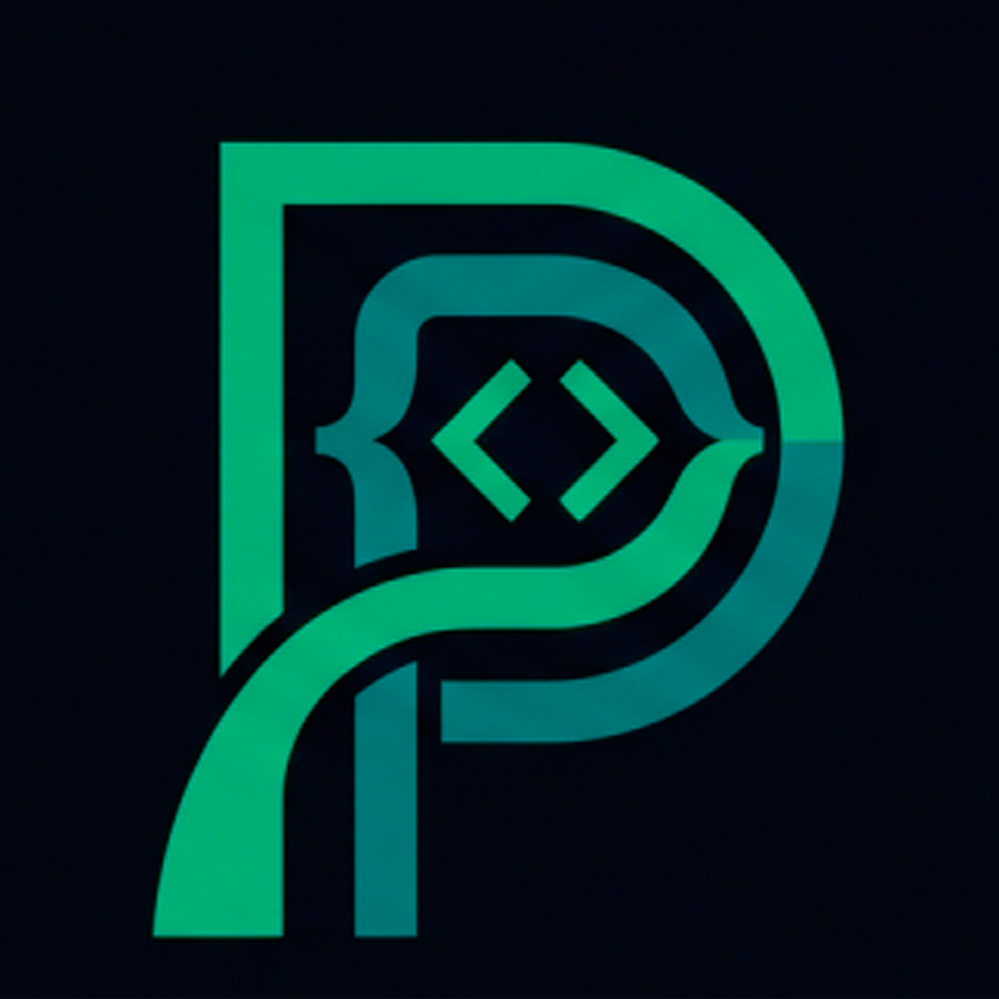

<div align="center">



# Pyrtugues

### Python em português, feito para aprender programação.

**Uma ferramenta educacional para quem quer começar a programar usando uma sintaxe em português, mantendo a lógica do Python como base.**

[](https://github.com/pyrtugues/Pyrtugues/releases)
[](https://www.python.org/)
[](https://pyrtugues-editor.netlify.app/)
[](https://github.com/pyrtugues/Pyrtugues)

### 🌐 [Site oficial](https://pyrtugues.netlify.app/) · 🧪 [Editor Web](https://pyrtugues-editor.netlify.app/) · 📦 [Downloads](https://github.com/pyrtugues/Pyrtugues/releases/latest)

</div>

---

## 📚 O que é o Pyrtugues?

**Pyrtugues** é um projeto educacional de programação em português criado para facilitar o primeiro contato com a lógica de programação e com o Python.

A proposta é simples: em vez de começar imediatamente com vários comandos em inglês, o estudante pode escrever estruturas familiares em português e aprender os mesmos conceitos fundamentais de programação.

O Pyrtugues trabalha como uma **ponte para o Python**. O código escrito em Pyrtugues é processado por um motor de tradução que o converte para a sintaxe correspondente em Python antes da execução.

A ideia não é substituir o Python. A ideia é **facilitar a entrada no mundo da programação e, depois, ajudar o estudante a fazer a conexão entre a sintaxe em português e o Python tradicional**.

> **Pyrtugues = programação em português + lógica do Python + aprendizado progressivo.**

---

## ✨ Por que o Pyrtugues existe?

Para muitas pessoas que estão começando a programar, uma das primeiras dificuldades é entender ao mesmo tempo **lógica, sintaxe, comandos e termos em inglês**.

O Pyrtugues tenta reduzir essa barreira inicial sem transformar programação em um sistema de blocos. A estrutura continua próxima da programação textual e da lógica usada em Python.

Com isso, o estudante pode começar com algo mais natural em português, entender variáveis, condições, repetições, funções e expressões, e posteriormente reconhecer esses mesmos conceitos em Python.

---

## 🧠 Como funciona?

```text
┌─────────────────────────────┐
│       Código Pyrtugues      │
│                             │
│  se idade maior que 10:     │
│      mostrar("Olá!")       │
└──────────────┬──────────────┘
               │
               ▼
┌─────────────────────────────┐
│      Motor de tradução      │
└──────────────┬──────────────┘
               │
               ▼
┌─────────────────────────────┐
│       Código em Python      │
│                             │
│  if idade > 10:             │
│      print("Olá!")         │
└──────────────┬──────────────┘
               │
               ▼
          EXECUÇÃO
```

### Exemplo básico

**Pyrtugues:**

```pyrtugues
idade = 12

se idade maior que 10:
    mostrar("Olá! Você pode programar!")
```

**Python equivalente:**

```python
idade = 12

if idade > 10:
    print("Olá! Você pode programar!")
```

Esse formato ajuda o estudante a perceber que a sintaxe muda, mas o raciocínio de programação continua reconhecível.

---

## 🚀 Recursos

### 🟢 Sintaxe em português

Comandos comuns podem ser escritos em português, tornando o primeiro contato com programação mais acessível para falantes de português.

### 🐍 Baseada na lógica do Python

O projeto procura manter uma estrutura próxima da lógica e da organização do Python, funcionando como uma ponte para a linguagem tradicional.

### 🖥️ Aplicação desktop

O Pyrtugues possui uma versão para computador com interface gráfica, editor de código, execução do programa e recursos voltados para estudo.

### 🌐 Editor Web

Existe também uma versão que roda no navegador, permitindo experimentar o Pyrtugues sem depender da instalação da versão desktop.

### 📖 Exemplos para aprender

O projeto inclui exemplos e experiências práticas para ajudar quem está começando com variáveis, condições, repetições, funções e operações.

### ⌨️ Experiência de editor

A versão desktop conta com recursos de edição voltados para facilitar o uso do código, incluindo numeração de linhas e atalhos de edição.

---

## 🔤 Alguns comandos e equivalências

O vocabulário do Pyrtugues continua em desenvolvimento. Alguns exemplos de mapeamento incluem:

| Pyrtugues | Python |
|---|---|
| `mostrar()` | `print()` |
| `pergunte()` | `input()` |
| `se` | `if` |
| `senão` | `else` |
| `senão se` | `elif` |
| `enquanto` | `while` |
| `para` | `for` |
| `em` | `in` |
| `função` | `def` |
| `retornar` | `return` |
| `importar` | `import` |
| `tentar` | `try` |
| `excepto` | `except` |
| `inteiro()` | `int()` |
| `decimal()` | `float()` |
| `texto()` | `str()` |
| `intervalo()` | `range()` |
| `tamanho()` | `len()` |
| `verdadeiro` | `True` |
| `falso` | `False` |
| `nulo` | `None` |

> O conjunto de comandos suportados pode mudar conforme o desenvolvimento do projeto. Consulte o código e os exemplos da versão atual para saber o que está disponível.

---

## 🧪 Exemplos práticos

### Olá, mundo

```pyrtugues
mostrar("Olá, mundo!")
```

### Variáveis

```pyrtugues
nome = "Vinicius"
idade = 12

mostrar(f"Meu nome é {nome} e tenho {idade} anos.")
```

### Condição

```pyrtugues
idade = 12

se idade maior que 10:
    mostrar("Você passou da primeira etapa!")
senão:
    mostrar("Continue estudando!")
```

### Repetição

```pyrtugues
para numero em intervalo(1, 6):
    mostrar(numero)
```

### Função

```pyrtugues
função saudacao(nome):
    retornar f"Olá, {nome}!"

mostrar(saudacao("Pyrtugues"))
```

> Os exemplos acima representam a proposta sintática do projeto. A compatibilidade exata de cada recurso pode variar conforme a versão do motor de tradução.

---

## 🖥️ Versão Desktop

A versão desktop é voltada para uso em computadores Windows e reúne a experiência de edição e execução do Pyrtugues em uma interface gráfica.

### Baixar

➡️ **[Abrir a página de Releases](https://github.com/pyrtugues/Pyrtugues/releases/latest)**

O GitHub permite manter um link permanente para a versão mais recente usando `/releases/latest`. Isso evita precisar trocar o link toda vez que uma nova versão é publicada.

### Código principal

O repositório inclui o código Python da aplicação, atualmente organizado principalmente no arquivo:

```text
Pyrtugues_code.py
```

---

## 🌐 Editor Web — Pyrtugues Online

O projeto também possui um editor web para experimentar a linguagem diretamente no navegador:

### 👉 [Abrir o Editor Web do Pyrtugues](https://pyrtugues-editor.netlify.app/)

A versão web utiliza tecnologias de navegador e **Pyodide** para executar Python no ambiente do browser.

A proposta da versão online é tornar o teste do Pyrtugues rápido e acessível, sem transformar o navegador em uma versão completamente diferente da linguagem.

---

## 🏠 Site oficial

Conheça a página institucional do projeto:

### 👉 [https://pyrtugues.netlify.app/](https://pyrtugues.netlify.app/)

No site você pode encontrar informações sobre o projeto, acesso ao editor web, downloads e outros materiais relacionados ao Pyrtugues.

---

## 📦 Estrutura do repositório

A estrutura pode evoluir com o projeto, mas atualmente inclui as principais partes abaixo:

```text
Pyrtugues/
├── assets/
│   └── logo-pyrtugues.png
├── LICENSE
├── README.md
├── Pyrtugues_code.py
├── index.html
└── ...
```

### O que cada parte representa?

| Arquivo / pasta | Função |
|---|---|
| `assets/` | Recursos visuais do projeto |
| `LICENSE` | Termos de uso e distribuição |
| `README.md` | Documentação principal do repositório |
| `Pyrtugues_code.py` | Código da versão desktop |
| `index.html` | Parte web do projeto |

---

## 🛠️ Tecnologias

### Desktop

- **Python** — linguagem utilizada no núcleo da aplicação
- **CustomTkinter** — interface gráfica
- **Tkinter** — recursos de interface e edição

### Web

- **HTML**
- **CSS**
- **JavaScript**
- **Tailwind CSS**
- **Pyodide** — ambiente para Python no navegador
- **Web Worker** — execução separada no ambiente web

---

## 🚀 Começando pelo código-fonte

Para clonar o repositório:

```bash
git clone https://github.com/pyrtugues/Pyrtugues.git
```

Depois:

```bash
cd Pyrtugues
```

A partir daí, consulte os arquivos e exemplos da versão atual para executar a parte do projeto que você deseja estudar.

> Como o Pyrtugues possui componentes desktop e web, o procedimento de execução pode variar conforme a parte do repositório que você está utilizando.

---

## 🔎 Pyrtugues na internet

O projeto mantém a mesma identidade e nome em seus principais canais:

| Canal | Endereço |
|---|---|
| 🌐 Site oficial | [pyrtugues.netlify.app](https://pyrtugues.netlify.app/) |
| 🧪 Editor Web | [pyrtugues-editor.netlify.app](https://pyrtugues-editor.netlify.app/) |
| 💻 GitHub | [github.com/pyrtugues/Pyrtugues](https://github.com/pyrtugues/Pyrtugues) |
| 👤 Perfil | [github.com/pyrtugues](https://github.com/pyrtugues) |
| 📦 Releases | [github.com/pyrtugues/Pyrtugues/releases/latest](https://github.com/pyrtugues/Pyrtugues/releases/latest) |

Se você encontrou o projeto por uma pesquisa como **“Pyrtugues”**, **“Pyrtugues programação”**, **“programação em português baseada em Python”** ou **“Python em português”**, este é o repositório principal do projeto.

---

## 📌 Estado do projeto

**Versão atual do repositório: 1.2.0**

O Pyrtugues continua em desenvolvimento. Novos comandos, correções, exemplos, melhorias de tradução, interface, documentação e ferramentas educacionais podem aparecer nas próximas versões.

O objetivo é evoluir sem perder a proposta central: **facilitar o aprendizado de programação em português e criar uma ponte clara para o Python.**

---

## 🤝 Contribuições

O projeto pode receber contribuições através do GitHub, especialmente em áreas como:

- testes de exemplos;
- identificação e documentação de bugs;
- sugestões de comandos;
- melhorias na documentação;
- exemplos educacionais;
- melhorias no código.

Ao trabalhar no tradutor, é importante testar cuidadosamente alterações que possam afetar nomes de variáveis, strings, comentários, f-strings, expressões e código já suportado.

### Issues

Encontrou um problema? Abra uma issue no GitHub:

👉 [Issues do Pyrtugues](https://github.com/pyrtugues/Pyrtugues/issues)

---

## 📜 Licença

O Pyrtugues **não utiliza a licença MIT atualmente**.

O projeto possui uma licença própria. Ela estabelece permissões para uso pessoal e educacional individual e define regras específicas para uso institucional, comercial, redistribuição e modificações.

Antes de copiar, distribuir, modificar ou utilizar o Pyrtugues em qualquer contexto diferente do permitido, leia o arquivo:

👉 **[`LICENSE`](./LICENSE)**

A publicação do código no GitHub não deve ser interpretada como autorização para usos que a licença não permita.

---

## 👨‍💻 Criador

**Vinicius Caracciolo**

O Pyrtugues nasceu como um projeto pessoal de programação e educação, com a ideia de tornar o primeiro contato com código mais acessível para falantes de português.

O projeto começou quando seu criador tinha **12 anos** e foi crescendo para incluir uma aplicação desktop, uma versão web, documentação, exemplos e uma identidade própria.

### Projeto pessoal → projeto público

A intenção do Pyrtugues é continuar evoluindo como um projeto independente, documentado publicamente e conectado a uma comunidade de pessoas interessadas em programação e educação.

---

## ⭐ Como apoiar o Pyrtugues

Você pode ajudar o projeto de formas simples:

- ⭐ dar uma estrela no GitHub;
- 🧪 testar o editor web;
- 🐛 reportar bugs;
- 💡 sugerir melhorias;
- 📖 ajudar com documentação e exemplos;
- 🔗 compartilhar o projeto com quem está aprendendo programação.

👉 **[Dar uma estrela no GitHub](https://github.com/pyrtugues/Pyrtugues)**

---

## 🗺️ Próximos passos

Algumas áreas que podem evoluir no futuro incluem:

- mais comandos e recursos do Python;
- melhorias no tradutor;
- tratamento de erros mais amigável;
- novos exemplos e exercícios;
- documentação mais completa;
- melhorias na experiência do editor;
- materiais para aprendizagem;
- novas plataformas e versões.

Esses planos podem mudar conforme o desenvolvimento do projeto.

---

## 💚 Pyrtugues

<div align="center">

### Programação em português.
### Lógica de Python.
### Uma ponte para aprender.

**Pyrtugues — Python em português, feito para aprender programação.**

[🌐 Site](https://pyrtugues.netlify.app/) · [🧪 Editor Web](https://pyrtugues-editor.netlify.app/) · [💻 GitHub](https://github.com/pyrtugues/Pyrtugues) · [📦 Releases](https://github.com/pyrtugues/Pyrtugues/releases/latest)

</div>
